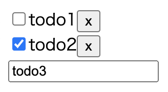

# clojure-practice

## requirements

- Java 11
- Clojure CLI
- Node.js
- Docker

## start database

```shell
docker compose up
```

## start api

```shell
cd api
clojure -M -m api.core
```

## start web

```shell
cd web
npx shadow-cljs watch app
```

## demo



## todo

[spreadsheet](https://docs.google.com/spreadsheets/d/18H9-VHUaltfoM3eXUyRUwiAIOPNFZ2GLonaz0oxnA-w/edit?usp=sharing)
